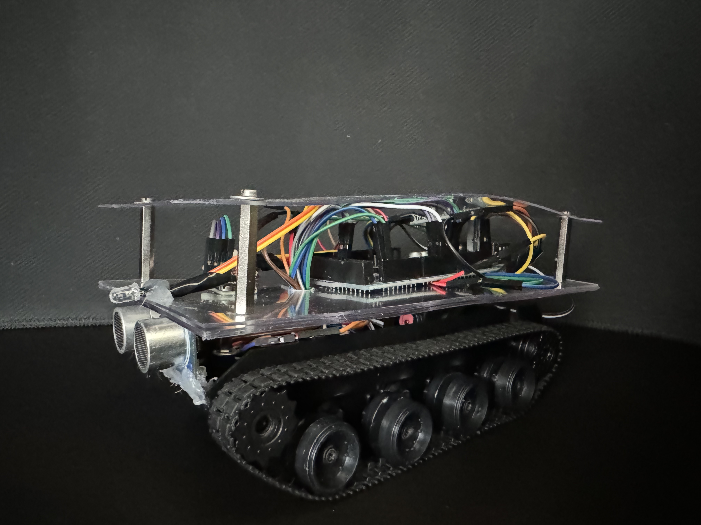

# Tank

> A simple robot vehicle built on Arduino and controlled via Bluetooth

<!-- TODO: Replace with a better photo -->

This tank is built on Arduino MEGA 2560 using [PlatformIO](https://platformio.org/).
It is equipped with several sensors and a bluetooth module, so it can be controlled remotely via a web app.

## Control app

The control app is a regular web application written in React.js and uses [Web Bluetooth API](https://developer.mozilla.org/en-US/docs/Web/API/Web_Bluetooth_API) for connecting and communicating with the bluetooth module of the tank.

Once the connection is established, you can read sensor values from the board and also control the tank movement with the buttons.

[Github repository](https://github.com/jozefcipa/tank-app)

## Sensors
This tank is equipped with several sensors to measure the surrounding environment.
Here's the block diagram of the whole board.

<!-- TODO: Replace with a better photo -->

### Sonar

Distance measuring is possible thanks to the [HC-SR04](https://www.laskakit.cz/arduino-ultrazvukovy-meric-vzdalenosti-hc-sr04/) ultrasonic sensor.

| HC-SR04 sonar | Arduino |
| -------- | ------- |
| Trigger        | D32        |
| Echo           | D30        |
| GND            | GND       |
| VCC            | 5V        |

### Compass

For direction detection the robot uses the [HMC5883L](https://www.laskakit.cz/3-osy-magnetometr-a-kompas-hmc5883l/) compass which uses the I2C communication protocol.

| HMC5883L compass | Arduino |
| -------- | ------- |
| SCL              | SCL           |
| SDA              | SDA           |
| GND              | GND           |
| VCC              | 5V            |

### Thermometer

Measuring temperature and humidity is handled by the [SHT-40](https://www.laskakit.cz/laskakit-sht40-senzor-teploty-a-vlhkosti-vzduchu/) sensor which uses the I2C communication protocol.

| SHT-40 thermometer | Arduino |
| ------ | ------- |
| SCL          | SCL            |
| SDA          | SDA            |
| GND          | GND            |
| VCC          | 3.3V           |

### Motors

This robot uses two DC motors that are integrated into the [tank chassis](https://www.laskakit.cz/roboticky-podvozek-pasovy-plastovy/) and uses the [TB6612FNG](https://www.laskakit.cz/dvoumotorovy-radic-tb6612fng/)  driver for controlling the motors.

| TB6612FNG motors driver | Arduino |
| ----------------- | ------- |
| AIN1              | D2      |
| AIN2              | D3      |
| PWMA              | D4      |
| BIN1              | D6      |
| PWMB              | D7      |
| STBY              | D8      |
| GND               | GND     |
| VCC               | 5V      |

## Bluetooth

This tank uses the [HM-10](https://www.laskakit.cz/huamao-hm-10c-a-orig--bluetooth-v4-0-ble-modul-cc254x/) Bluetooth 4.0 module which supports Bluetooth Low Energy (BLE) and thus can be used for connecting to the controling app running in a browser.

| HM-10 Bluetooth | Arduino                                             | Notes |
| --------- | ------- | --------------------------------------------------- |
| RX                 | D13            | Connected via a voltage divider. See the diagram below. |
| TX                 | D12            |  |
| STATE              | -              | Connected to the blue LED through a 220R resistor |
| VCC                | 3.3V           |  |
| GND                | GND            |  |

When connecting with Arduino, we need to add a voltage divider between RX pin of the bluetooth module and TX pin of the Arduino board, as they are working on different voltage levels (5V vs. 3.3V).
The electric circuit can be seen on the diagram below.

<small>
  Diagram from <a href="https://www.martyncurrey.com/hm-10-bluetooth-4ble-modules/" target="_blank">martyncurrey.com</a>
</small>

## LEDs

The robot uses the following LEDs for different purposes.  
There is white (FRONT) and red (REAR) LED that serve as lights. 
Once the program is loaded and everything is initialized, the green LED (STATUS) will blink at the beginning of each loop. 
 Lastly, we have the blue LED (BLUETOOTH) that turns on once the Bluetooth connection with the controlling app is established.

| LED     | Arduino   | Notes |
| --------- | ------- | --------------------------------------------------- |
| STATUS    | D52      | Through a 330R resistor |
| FRONT     | D50     | Through a 330R resistor |
| REAR      | D48     | Through a 330R resistor |
| BLUETOOTH | -       | Connected to the BT module, through a 220R resistor  |
